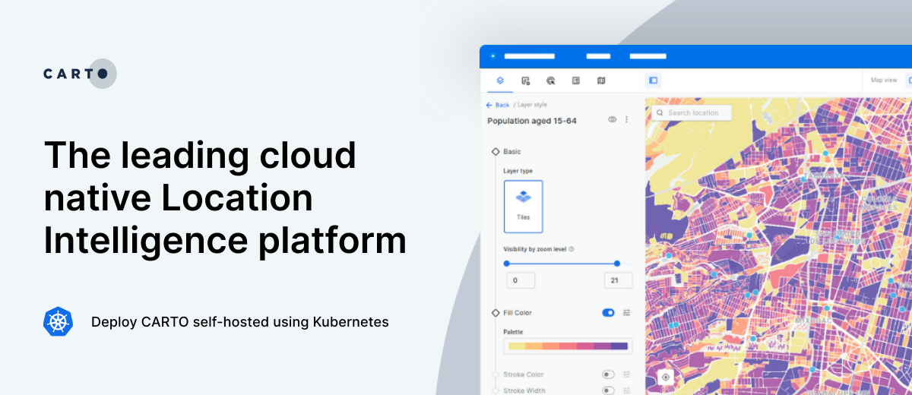

# CARTO self-hosted for Kubernetes

<!--
- Add how to contact sales or request a live demo
- Add info about the CARTO SaaS environment
- Add info about the Docker flavor?
- Add info about the CHANGELOG.md
--->

## What is CARTO Self-hosted?

<!-- TODO: Add brief explanation -->

## Orchestrated container deployment

This repository contains all the files needed to deploy CARTO Self-hosted using Kubernetes and Helm

## Documentation

<!-- TODO: Add reference to the official docs.carto.com -->